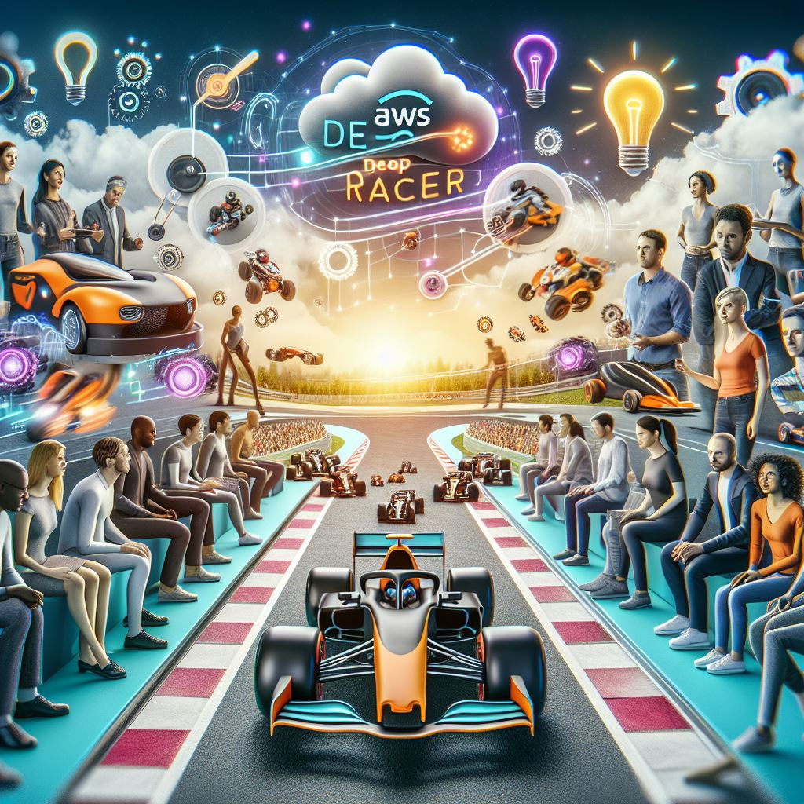
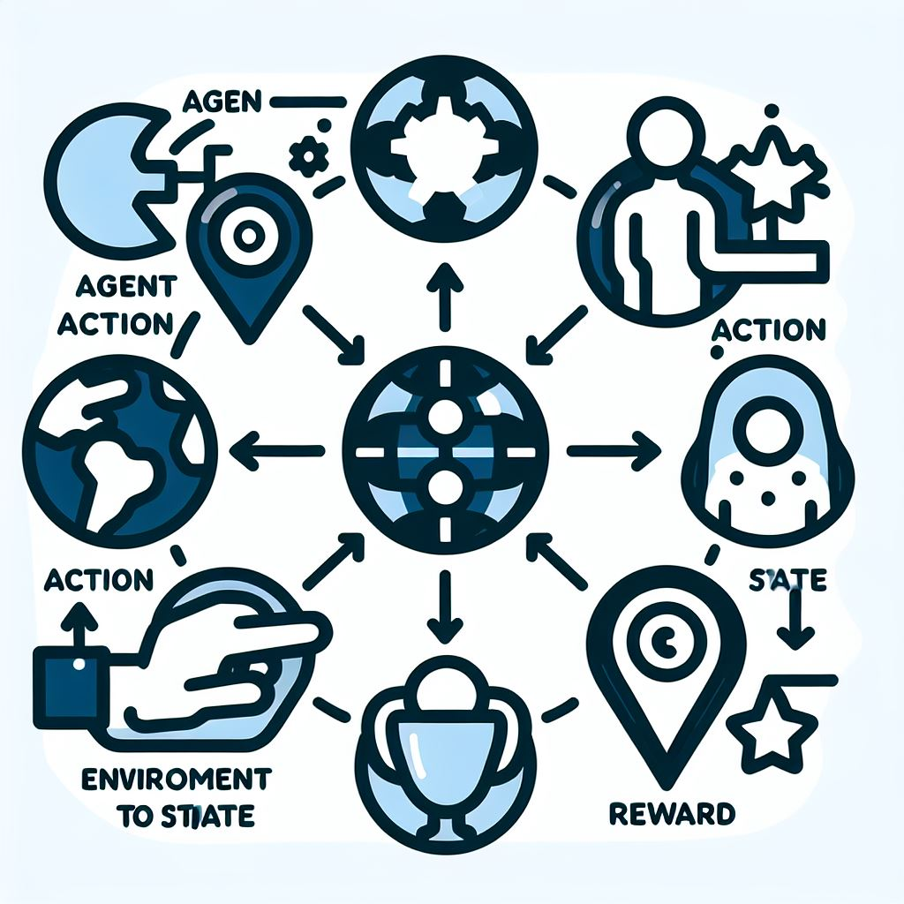
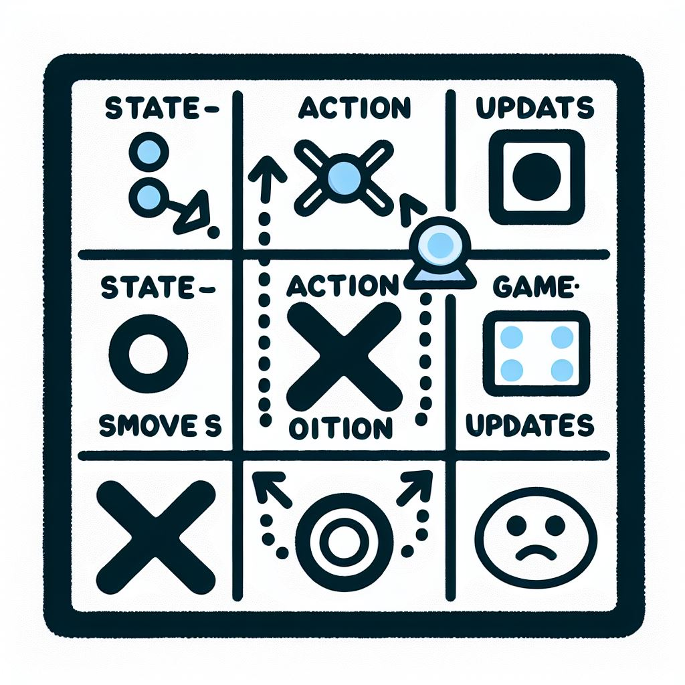

### Diving into Reinforcement learning via AWS Deep Racer

<section>
    <div style="display: flex; align-items: center; justify-content: space-between;">
        <!-- Text Section on the Left -->
        <div style="flex: 1; padding-right: 20px;">
            <p>Reinforcement learning (RL) is a machine learning paradigm where an <em>agent</em> learns to make optimal decisions within an <em>environment</em> by trial and error. The agent's actions influence its state, and it receives <em>rewards</em> or <em>penalties</em> based on the outcome. The goal is to learn a <em>policy</em> – a strategy for selecting actions – that maximizes its long-term cumulative reward.</p>
        </div>
        <!-- Image Section on the Right -->
        <div style="flex: 1; padding-left: 20px;">
            
        </div>
    </div>
</section>

<sup>[Notes from AWS DeepRacer](https://github.com/kurtzace/diary-2024/issues/14)</sup>

@


**Key Concepts:**
- **Agent**: The learner or decision maker (e.g., DeepRacer car).
- **Environment**: The world the agent interacts with (e.g., the race track).
- **State**: The current situation of the agent (e.g., position on track).
- **Action**: The decision taken by the agent (e.g., move forward, turn left).
- **Reward**: The feedback from the environment (e.g., staying on track).
@


<section>
    <div style="display: flex; align-items: center; justify-content: space-between;">
        <!-- Text Section on the Left -->
        <div style="flex: 1; padding-right: 20px;">
           
        </div>
        <!-- Image Section on the Right -->
        <div style="flex: 1; padding-left: 20px;">
            
        </div>
    </div>
</section>

@


### Types of ML


^


<section>
    <div style="display: flex; align-items: center; justify-content: space-between;">
        <!-- Text Section on the Left -->
        <div style="flex: 1; padding-right: 20px; max-width:350px">
    <b>Learning Process</b>
    <ul>
        <li>Calculate returns</li>
        <li>Update Q-values</li>
        <li>Improve policy</li>
    </ul><br/>
    <b>Explore-Exploit Dilemma</b>
    <ul>
        <li>Explore: collect more data to determine best outcome - trying new actions to discover better strategies</li>
        <li>Update Q-values</li>
        <li>Exploit: play with best policy to win - maximize rewards</li>
    </ul>
        </div>
        <div style="flex: 1; padding-left: 20px;">
            
        </div>
    </div>
</section>

^


### Core RL Concepts: A Simplified View

While the math can be complex, the core ideas are intuitive:

* **Policy (π(a|s))**:  The agent's strategy: what action (a) to take in state (s).
* **Value Function (V(s))**:  How good it is to be in state (s).
* **Q-Function (Q(s,a))**: How good it is to take action (a) in state (s).

@


### Reinforcement Learning Glossary

**Markov Decision Process (MDP):** A Markov Decision Process is a mathematical framework for modeling decision-making in environments where outcomes are partly random and partly under the control of a decision maker.

- Discrete Finite Time: The process occurs over a finite number of steps or episodes.
- Stochastic: Incorporates randomness in state transitions and rewards.

**Q Learning**: Q-Learning is a model-free reinforcement learning algorithm used to find the optimal action-selection policy for a given finite Markov Decision Process (MDP).

@


**Bellman Eq**:
Bellman Equation: Provides a recursive decomposition for calculating the value of a state under a particular policy.

Bellman Equation for Q-values (Q-Learning): Focuses on action-value pairs, providing a way to evaluate the utility of actions taken in states.

<sup>Bellman equation for state values:

 (Represents the expected cumulative reward of being in a state ( s ) and following a policy ( \pi ).)
@


Bellman equation for Q-values:

 (Represents the expected cumulative reward of taking an action ( a ) in state ( s ) and following the optimal policy thereafter.)</sup>

**Monte Carlo:** requires terminal state
Monte Carlo methods are a broad class of computational algorithms that rely on repeated random sampling to obtain numerical results. In the context of reinforcement learning, Monte Carlo methods are used to estimate the value of states and actions by averaging the returns (cumulative rewards) received from multiple episodes of interaction with the environment. 

^


### Finite Markov Decision Process

**Key Points**:
- Episodic (terminates) or Continuing
- Trajectory: elements generated when agent moves from state to another.
- Episode: Trajectories to final state
- Reward (maximize sum) vs Return (short term return may impact long -term reward)


^


### Tic-Tac-Toe Analogy



@


```python
class TicTacToeRL:
    def __init__(self): self.q_table = {}
    def choose_action(self, state): 
        return max(self.q_table.get(state, {}), key=self.q_table.get(state, {}).get, default='random')
    def update_q(self, s, a, r, s_): 
        self.q_table.setdefault(s, {})[a] = r + 0.9 * max(self.q_table.get(s_, {}).values(), default=0)
    def play_game(self): 
        state, done = 'initial', False; 
        while not done: 
            action = self.choose_action(state); 
            state, reward, done = self.take_action(action); 
            self.update_q(state, action, reward, state)
```
@


**Key Points**:
- Initialization: A Q-table is initialized to store state-action values.
- Action Selection: Chooses an action based on the maximum Q-value for the current state, defaulting to 'random' if the state is unknown.
- Q-value Update: Updates the Q-value for a given state-action pair using the reward and estimated future rewards.
- Game Loop: Simulates playing the game by selecting actions and updating the Q-table until the game is done.

^


### Policy and Value Functions

**Policy**: Yield an action - given a current state

```python
def get_action(s): 
    if random() < epsilon: 
        a = sample from action space 
    else: 
        a = fixed policy[s]  
    return a
```
@


Policy parameter - W (shape is D x |A|)

```math
π(a|S) = softmax(W^T s)
```
Reward: Maximize the sum of future gains. Not immediate gratification.


Discounting is used for infinite horizon


^


### AWS DeepRacer Experience

AWS DeepRacer is a 1/18th scale race car that gives you an exciting way to get started with reinforcement learning (RL).


@


**Car Features:**
- Intel Atom processor
- Intel distribution of OpenVINO toolkit
- Front-facing camera (4 megapixels)
- System memory: 4 GB RAM
- 802.11ac Wi-Fi
- Ubuntu 20.04 Focal Fos
- ROS 2 Foxy Fitzroy
- AWS DeepRacer Evo Expansion Pack
- Second front-facing camera (stereo cameras)
- 260-degree, 12-meter scanning radius Lidar sensor

^


### 3D Racing Simulator

AWS DeepRacer uses a 3D racing simulator to train models in a virtual environment.


@


**Key Concepts:**
- **Agent**: The DeepRacer car
- **Environment**: The race track
- **Action**: Decisions made by the car (e.g., speed, steering angle)
- **Reward**: Feedback based on the car's performance (e.g., staying on track)

**Episodes**: Training iterations from start to finish or until the car drives off the track.

^


### Reward Functions

Reward functions are critical in guiding the agent's learning process.


@


**Key Parameters:**
- **Position on Track**: (x, y) coordinates
- **Heading**: Orientation of the car
- **Waypoints**: Ordered list of milestones on the track
- **Track Width**: Width of the track
- **Distance from Center**: Distance of the car from the track centerline
- **All Wheels on Track**: Boolean indicating if all wheels are on the track
- **Speed**: Current speed of the car
- **Steering Angle**: Angle of the front wheels

@


**How did Aws Ascertain Parameters**
Image below shows how AWS leverages CNN to give us input parameters


^


### Example Reward Functions

**Follow Center Line**

This reward function incentivizes the car to stay close to the center of the track.

```python
def reward_function(params):
    track_width = params['track_width']
    distance_from_center = params['distance_from_center']

    marker_1 = 0.1 * track_width
    marker_2 = 0.25 * track_width
    marker_3 = 0.5 * track_width

    if distance_from_center <= marker_1:
        reward = 1.0
    elif distance_from_center <= marker_2:
        reward = 0.5
    elif distance_from_center <= marker_3:
        reward = 0.1
    else:
        reward = 1e-3

    return float(reward)
```
@


**Prevent Zig-Zag**

This reward function penalizes excessive steering to prevent zig-zag behavior.

```python
def reward_function(params):
    distance_from_center = params['distance_from_center'],  track_width = params['track_width'], abs_steering = abs(params['steering_angle'])

    marker_1 = 0.1 * track_width
    marker_2 = 0.25 * track_width
    marker_3 = 0.5 * track_width

    if distance_from_center <= marker_1:  reward = 1.0
    elif distance_from_center <= marker_2: reward = 0.5
    elif distance_from_center <= marker_3: reward = 0.1
    else:  reward = 1e-3
    ABS_STEERING_THRESHOLD = 15
    if abs_steering > ABS_STEERING_THRESHOLD: reward *= 0.8
    return float(reward)
```

^


### Setting Up Your Racer Profile


@


**Example Track:**
A to Z Speedway
- Length: 16.64 m (54.59')
- Width: 107 cm (42")
- Direction: Clockwise, Counterclockwise

^


### Clockwise Waypoints

Downloaded the track numpy file and plotted the waypoints for the clockwise track.


@


```python
import matplotlib.pyplot as plt
import numpy as np
tracksPath = '~/Downloads/reInvent2019_wide_cw.npy'
track_name = "A to Z Speedway"
absolute_path = "."
waypoints = np.load(tracksPath)
print("Number of waypoints = " + str(waypoints.shape[0]))

for i, point in enumerate(waypoints):
    waypoint = (point[2], point[3])
    plt.scatter(waypoint[0], waypoint[1])
    plt.text(waypoint[0], waypoint[1], str(i), fontsize=9, ha='right')
    print("Waypoint " + str(i) + ": " + str(waypoint))

plt.xlabel('X Coordinate')
plt.ylabel('Y Coordinate')
plt.title(f'Waypoints for {track_name}')
plt.show()
```

^


### Clockwise Reward Function

The Clockwise Reward Function incentivizes the car to follow the correct speed and direction based on waypoints.

[Link to code snippet](https://github.com/aws-experiments/aws_deep_racer_slides/blob/master/code/clockwise_reward_function.py)

**Key Points:**
- Penalize for offtrack.
- Prevent zig-zag behavior.
- Reward for maintaining appropriate speed based on waypoints.
- Adjust rewards based on distance from center.
- Heading direction reward for maintaining the correct heading.

^


### Percentage Reward Function

The Percentage Reward Function adjusts rewards based on the car's progress along the track.

[Link to code snippet](https://github.com/aws-experiments/aws_deep_racer_slides/blob/master/code/percentage_reward_function.py)

**Key Points:**
- Penalize for offtrack or reversing.
- Prevent zig-zag behavior.
- Reward for maintaining appropriate speed based on progress percentage.
- Adjust rewards based on distance from center.
- Heading direction reward for maintaining the correct heading.
@

Imagine a compass superimposed on track


^


### Race day Experience
<section>
    <div style="display: flex; align-items: center; justify-content: space-between;">
        <!-- Video Section on the Right -->
        <div style="flex: 1; padding-left: 20px;">
            <video width="100%" controls>
                <source src="https://github.com/user-attachments/assets/dc700014-aa9f-4bb1-8c80-4c478a261f60" type="video/mp4">
                Your browser does not support the video tag.
            </video>
        </div>
    </div>
</section>

^


### Conclusion

AWS DeepRacer combines the excitement of racing with the challenge of machine learning, making it an excellent tool for both education and entertainment.

